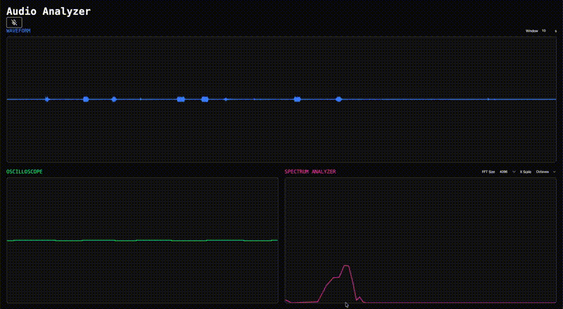

# Audio Dashboard

A real-time browser-based set of audio analysis tools. Visualizes audio input in multiple displays: scrolling waveform history, oscilloscope, and spectrum analyzer. Built with React and TypeScript.



## Capabilities

### Waveform History

Graphs the audio input in real time, scrolling from right to left with an adjustable time window between 0 and 30 seconds (default 10, setting to 0 pauses the display). Uses an `AudioWorkletProcessor` running on the audio thread to record audio without dropping any samples.

### Oscilloscope

Instantaneous display of the waveform. Shows the shape of the wave at the current moment.

### Spectrum Analyzer

Instantaneous display of the frequency spectrum of the audio. Uses an `AnalyserNode` to perform a Fast Fourier Transform (FFT). FFT size is configurable from 512 to 32768 (default 4096, must be a power of 2). X-axis scale is also configurable with three options (default octaves):

- Linear: equal spacing per Hz
- Decades: logarithmic base-10 scale
- Octaves: logarithmic base-2 scale (matches how humans perceive pitch)

## Technical Implementation

### Waveform Capture Architecture

The waveform history component is implemented as a producer-consumer model using an `AudioWorkletProcessor` running on the audio thread to sample the input in real time. Audio data is shared with the graphics task via a circular buffer. This architecture ensures each sample is processed exactly once and allows the audio and graphics tasks to run asynchronously.

### Sub-Pixel Scrolling

At audio sample rates (44.1 kHz or 48 kHz), each sample occupies only a small fraction of a pixel. The waveform history component accumulates fractional pixel offsets and waits to draw the waveform until it has at least one full pixel's worth of samples. It then draws an integer number of pixels, carrying the remaining samples (and pixel offsets) into the next draw. This prevents ghosting artifacts that would appear from shifting the display by a fractional number of pixels.

## Lessons Learned

### Plotting Audio Waveform in Real Time

Initially, I implemented the waveform history component by polling the `AnalyserNode` and graphing the most recent sample. However, that effectively reduced my audio sample rate to 60 Hz, which meant that due to the Nyquist-Shannon sampling theorem, I could not plot the audio waveform with any fidelity for signals above 30 Hz. I could have synchronized my graphics task to the `AnalyserNode` and waited for it to fill its buffer, but that would have created a few problems. First, since I would have to poll the `AnalyserNode`'s clock, the graphics task would lose track of time whenever the tab was in the background. Second, because the graphics task runs at a lower frequency than the audio task, it would lose some samples during the polling cycle immediately before drawing. And third, it would reduce the frame rate to 12 fps, providing a worse experience for the user.

Instead, I tried polling the `AnalyserNode` and drawing the whole buffer every frame. This solved the sample rate issue but created its own problem. With a sample rate of 48 kHz and an FFT size of 4096, the `AnalyserNode` would write the whole buffer in 85.3 ms. However, since the graphics task was running at 60 fps, it would draw a frame every 16.7 ms. The graphics frame rate was effectively 5 times faster than the signal acquisition rate, so on every frame, 80% of the samples in the current buffer were present in the buffer during the previous frame. This caused the graphics task to draw every sample 5 times, which created ghosting artifacts and caused the audio to scroll 5 times faster than expected.

I realized that since I had a task generating data (audio) and a task processing it (graphics) running at different rates, this was a classic producer-consumer problem. I dispatched the audio task to the audio thread using an `AudioWorkletProcessor` and kept the graphics task on the main thread. I passed the audio samples from the audio task to the graphics task using a circular buffer, with the audio task maintaining the write head and the graphics task maintaining the read head.

### Graphing Sub-Pixel Data

Once I got the `AudioWorkletProcessor` up and running, I tried polling it every frame and graphing all the new samples since the previous frame. However, with a sample rate of 48 kHz, a window duration of 10 s, and a canvas width of 1000 px, each sample occupied only 0.004 px. This meant that each frame, my graphics task was drawing less than 1 px of data, which caused ghosting artifacts due to the canvas shifting by a fractional number of pixels each frame. Even if the graphics task had more than 1 px of data each frame, the width would still be fractional, causing the same issue.

I solved this by accumulating pixel offsets in the graphics task and waiting until enough new samples had been recorded to draw at least 1 px. I then drew samples corresponding to an integer number of pixels, saving the remaining samples for the next draw cycle.

## Future Capabilities

- Level meter
- Detect pitch in spectrum analyzer
- Change audio device
- Configurable grid layout
- Resizable canvases

## How to Run

There are two options to run this project. You can either visit the [online version](https://audio-dashboard.parkerpiedmont.dev/) or build and run the project on your own computer.

### Build and Run Locally

1. Clone the repository to your computer.

```sh
git clone https://github.com/pjpiedmont/audio-dashboard.git
cd audio-dashboard
```

2. Install dependencies and run the server.

```sh
npm install
npm run dev
```

3. Visit [http://localhost:5173](http://localhost:5173) in your browser.